# Runaway Labs - Database Entity Relationship Diagram

## ERD Overview

```mermaid
erDiagram
    %% Core Entities
    athletes {
        bigint id PK
        uuid auth_user_id FK
        varchar email
        varchar first_name
        varchar last_name
        char sex
        text description
        numeric weight
        varchar city
        varchar state
        varchar country
        varchar health_consent_status
        timestamptz health_consent_date
        timestamptz created_at
        timestamptz updated_at
        text access_token
        text refresh_token
        timestamptz token_expires_at
        boolean premium
        text fcm_token
        boolean strava_connected
        timestamptz strava_connected_at
        timestamptz strava_disconnected_at
        timestamptz last_sync_at
        timestamptz last_successful_sync_at
        integer total_syncs
        text profile
        text profile_medium
        text garmin_access_token
        text garmin_token_secret
        boolean garmin_connected
        timestamptz garmin_connected_at
        text garmin_refresh_token
        timestamptz garmin_token_expires_at
    }

    athlete_stats {
        bigint id PK
        bigint athlete_id FK
        integer count
        numeric distance
        bigint moving_time
        bigint elapsed_time
        numeric elevation_gain
        integer achievement_count
        numeric ytd_distance
        timestamptz created_at
        timestamptz updated_at
    }

    athlete_onboarding {
        integer id PK
        integer athlete_id FK
        boolean is_completed
        integer current_step
        double movement_test_cadence
        double movement_test_variance
        boolean location_permission_granted
        varchar coach_personality
        varchar experience_level
        timestamptz completed_at
        timestamptz created_at
        timestamptz updated_at
    }

    activity_types {
        bigint id PK
        varchar name
        varchar category
        text description
        timestamptz created_at
        timestamptz updated_at
    }

    activities {
        bigint id PK
        bigint athlete_id FK
        uuid auth_user_id FK
        bigint activity_type_id FK
        varchar name
        text description
        timestamptz activity_date
        timestamptz start_time
        integer elapsed_time
        integer moving_time
        integer timer_time
        numeric distance
        numeric elevation_gain
        numeric elevation_loss
        numeric elevation_low
        numeric elevation_high
        numeric max_grade
        numeric average_grade
        numeric average_positive_grade
        numeric average_negative_grade
        numeric max_speed
        numeric average_speed
        numeric average_elapsed_speed
        integer max_heart_rate
        integer average_heart_rate
        boolean has_heartrate
        integer max_watts
        integer average_watts
        integer weighted_average_watts
        boolean device_watts
        integer total_work
        integer max_cadence
        integer average_cadence
        integer calories
        integer max_temperature
        integer average_temperature
        varchar weather_condition
        integer humidity
        numeric wind_speed
        numeric wind_gust
        integer wind_bearing
        numeric precipitation_intensity
        numeric precipitation_probability
        varchar precipitation_type
        numeric cloud_cover
        numeric weather_visibility
        integer uv_index
        integer weather_ozone
        numeric weather_pressure
        integer apparent_temperature
        integer dewpoint
        boolean commute
        boolean flagged
        boolean with_pet
        boolean competition
        boolean long_run
        boolean for_a_cause
        boolean trainer
        boolean manual
        boolean private
        varchar filename
        varchar gear_id FK
        integer perceived_exertion
        integer relative_effort
        integer training_load
        numeric intensity
        numeric average_grade_adjusted_pace
        numeric grade_adjusted_distance
        numeric dirt_distance
        numeric newly_explored_distance
        numeric newly_explored_dirt_distance
        integer total_steps
        numeric carbon_saved
        integer pool_length
        integer total_cycles
        integer jump_count
        numeric total_grit
        numeric average_flow
        boolean from_upload
        integer resource_state
        varchar external_id
        timestamptz created_at
        timestamptz updated_at
        text map_polyline
        text map_summary_polyline
        numeric start_latitude
        numeric start_longitude
        numeric end_latitude
        numeric end_longitude
        text source
        jsonb raw_data
        text device_name
        double kilojoules
        integer suffer_score
        integer workout_type
        integer pr_count
        integer total_photo_count
    }

    %% Gear Entities
    brands {
        bigint id PK
        varchar name
        text description
        timestamptz created_at
        timestamptz updated_at
    }

    models {
        bigint id PK
        bigint brand_id FK
        varchar name
        varchar category
        text description
        timestamptz created_at
        timestamptz updated_at
    }

    gear {
        varchar id PK
        bigint athlete_id FK
        bigint brand_id FK
        bigint model_id FK
        varchar gear_type
        varchar name
        boolean is_primary
        bigint total_distance
        boolean retired
        timestamptz created_at
        timestamptz updated_at
    }

    %% Geographic Entities
    routes {
        bigint id PK
        bigint athlete_id FK
        varchar name
        varchar filename
        text description
        numeric distance
        numeric elevation_gain
        timestamptz created_at
        timestamptz updated_at
    }

    segments {
        bigint id PK
        bigint activity_id FK
        varchar name
        numeric start_latitude
        numeric start_longitude
        numeric end_latitude
        numeric end_longitude
        numeric distance
        numeric average_grade
        numeric maximum_grade
        numeric elevation_high
        numeric elevation_low
        integer climb_category
        varchar city
        varchar state
        varchar country
        boolean hazardous
        boolean starred
        timestamptz created_at
    }

    starred_routes {
        bigint athlete_id FK
        bigint route_id FK
        timestamptz starred_at
    }

    starred_segments {
        bigint athlete_id FK
        bigint segment_id FK
        timestamptz starred_at
    }

    %% Social Entities
    follows {
        bigint follower_id FK
        bigint following_id FK
        varchar follow_status
        boolean is_favorite
        timestamptz created_at
    }

    comments {
        bigint id PK
        bigint activity_id FK
        bigint athlete_id FK
        text content
        timestamptz comment_date
    }

    reactions {
        bigint id PK
        varchar parent_type
        bigint parent_id
        bigint athlete_id FK
        varchar reaction_type
        timestamptz reaction_date
    }

    %% Club Entities
    clubs {
        bigint id PK
        varchar name
        text description
        varchar club_type
        varchar sport
        varchar city
        varchar state
        varchar country
        varchar website
        varchar cover_photo
        varchar club_picture
        integer member_count
        timestamptz created_at
        timestamptz updated_at
    }

    memberships {
        bigint athlete_id FK
        bigint club_id FK
        timestamptz join_date
        varchar status
        varchar role
    }

    %% Challenge/Goal Entities
    challenges {
        bigint id PK
        varchar name
        varchar challenge_type
        date start_date
        date end_date
        text description
        numeric target_value
        varchar target_unit
        timestamptz created_at
    }

    challenge_participations {
        bigint athlete_id FK
        bigint challenge_id FK
        timestamptz join_date
        boolean completed
        timestamptz completion_date
        numeric progress_value
    }

    goals {
        bigint id PK
        bigint athlete_id FK
        varchar goal_type
        varchar activity_type
        numeric target_value
        date start_date
        date end_date
        bigint segment_id FK
        varchar time_period
        integer interval_time
        numeric current_value
        boolean completed
        timestamptz created_at
    }

    running_goals {
        bigint id PK
        bigint athlete_id FK
        varchar title
        varchar goal_type
        numeric target_value
        timestamptz deadline
        boolean is_active
        boolean is_completed
        numeric current_progress
        timestamptz created_at
        timestamptz updated_at
        timestamptz completed_at
    }

    daily_commitments {
        bigint id PK
        bigint athlete_id FK
        date commitment_date
        varchar activity_type
        boolean is_fulfilled
        timestamptz fulfilled_at
        timestamptz created_at
        timestamptz updated_at
        varchar commitment_level
        varchar micro_commitment_type
        integer progression_step
    }

    %% Media Entities
    media {
        bigint id PK
        bigint activity_id FK
        bigint athlete_id FK
        varchar filename
        text caption
        varchar media_type
        bigint file_size
        timestamptz created_at
    }

    %% System Entities
    connected_apps {
        bigint id PK
        bigint athlete_id FK
        varchar app_name
        boolean enabled
        timestamptz connected_at
        timestamptz last_used
    }

    logins {
        bigint id PK
        bigint athlete_id FK
        inet ip_address
        varchar login_source
        timestamptz login_datetime
        text user_agent
        varchar location
    }

    user_preferences {
        bigint id PK
        bigint athlete_id FK
        varchar units_system
        varchar privacy_level
        boolean notifications_enabled
        boolean dark_mode_enabled
        boolean auto_pause_enabled
        timestamptz created_at
        timestamptz updated_at
    }

    %% AI/Analytics Entities
    athlete_ai_profiles {
        uuid id PK
        integer athlete_id FK
        jsonb core_memory
        jsonb preferences
        timestamp last_updated
        integer version
    }

    activity_insights {
        bigint id PK
        bigint activity_id FK
        varchar insight_type
        jsonb insight_data
        numeric confidence_score
        varchar generated_by
        timestamptz created_at
    }

    activity_embeddings {
        uuid id PK
        bigint activity_id FK
        text summary
        vector embedding
        timestamp created_at
        timestamp updated_at
    }

    analytics_events {
        uuid id PK
        timestamptz created_at
        bigint athlete_id FK
        text device_id
        text event_name
        text event_category
        jsonb properties
        text app_version
        text os_version
        text device_model
        uuid session_id
        double latitude
        double longitude
    }

    training_zones {
        bigint id PK
        bigint athlete_id FK
        varchar zone_type
        integer zone_number
        numeric min_value
        numeric max_value
        timestamptz created_at
    }

    training_journal {
        uuid id PK
        bigint athlete_id FK
        date week_start_date
        date week_end_date
        text narrative
        jsonb week_stats
        jsonb insights
        jsonb goal_progress
        varchar generation_model
        timestamptz generation_timestamp
        timestamptz updated_at
    }

    weekly_training_plans {
        uuid id PK
        bigint athlete_id FK
        date week_start_date
        date week_end_date
        jsonb workouts
        integer week_number
        numeric total_mileage
        text focus_area
        text notes
        integer goal_id FK
        timestamptz generated_at
        timestamptz created_at
        timestamptz updated_at
        boolean is_regenerated
        text regeneration_reason
    }

    rest_days {
        uuid id PK
        integer athlete_id FK
        date date
        boolean is_planned
        text reason
        text notes
        integer recovery_benefit
        timestamptz created_at
        timestamptz updated_at
    }

    %% Sync Entities
    sync_jobs {
        uuid id PK
        bigint athlete_id FK
        varchar status
        varchar sync_type
        timestamptz created_at
        timestamptz started_at
        timestamptz completed_at
        integer total_activities
        integer processed_activities
        integer failed_activities
        timestamptz after_date
        timestamptz before_date
        text error_message
        text error_stack
        jsonb metadata
    }

    oauth_tokens {
        uuid id PK
        bigint athlete_id FK
        text access_token
        text refresh_token
        varchar token_type
        timestamptz expires_at
        text scope
        timestamptz created_at
        timestamptz updated_at
    }

    %% Relationships
    athletes ||--|| athlete_stats : "has"
    athletes ||--o| athlete_onboarding : "has"
    athletes ||--o| athlete_ai_profiles : "has"
    athletes ||--o{ activities : "performs"
    athletes ||--o{ gear : "owns"
    athletes ||--o{ routes : "creates"
    athletes ||--o{ follows : "follower"
    athletes ||--o{ follows : "following"
    athletes ||--o{ comments : "writes"
    athletes ||--o{ reactions : "makes"
    athletes ||--o{ memberships : "joins"
    athletes ||--o{ challenge_participations : "participates"
    athletes ||--o{ goals : "sets"
    athletes ||--o{ running_goals : "creates"
    athletes ||--o{ daily_commitments : "makes"
    athletes ||--o{ starred_routes : "stars"
    athletes ||--o{ starred_segments : "stars"
    athletes ||--o{ connected_apps : "connects"
    athletes ||--o{ logins : "logs_in"
    athletes ||--o{ media : "uploads"
    athletes ||--o| user_preferences : "has"
    athletes ||--o{ training_zones : "has"
    athletes ||--o{ training_journal : "has"
    athletes ||--o{ weekly_training_plans : "has"
    athletes ||--o{ rest_days : "has"
    athletes ||--o{ sync_jobs : "has"
    athletes ||--o| oauth_tokens : "has"
    athletes ||--o{ analytics_events : "generates"

    activity_types ||--o{ activities : "categorizes"
    activities ||--o{ segments : "contains"
    activities ||--o{ comments : "receives"
    activities ||--o{ reactions : "receives"
    activities ||--o{ media : "includes"
    activities ||--o{ activity_insights : "has"
    activities ||--o| activity_embeddings : "has"

    brands ||--o{ models : "manufactures"
    brands ||--o{ gear : "makes"
    models ||--o{ gear : "specifies"
    gear ||--o{ activities : "used_in"

    routes ||--o{ starred_routes : "starred_as"
    segments ||--o{ starred_segments : "starred_as"
    segments ||--o{ goals : "targets"

    clubs ||--o{ memberships : "has_members"
    challenges ||--o{ challenge_participations : "participated_in"

    running_goals ||--o{ weekly_training_plans : "informs"
```



## Activities Table - Complete Field Reference

This is the authoritative reference for the `activities` table. **Always consult this before any database operations.**

### Basic Info
| Column | Type | Constraints | Description |
|--------|------|-------------|-------------|
| `id` | bigint | PK, auto-generated | Primary key (sequence: 2000000001+) |
| `athlete_id` | bigint | FK, NOT NULL | Reference to athletes table |
| `auth_user_id` | uuid | FK | Reference to auth.users |
| `activity_type_id` | bigint | FK | Reference to activity_types |
| `name` | varchar | | Activity name |
| `description` | text | | Activity description |

### Timing
| Column | Type | Constraints | Description |
|--------|------|-------------|-------------|
| `activity_date` | timestamptz | NOT NULL | Date/time of activity |
| `start_time` | timestamptz | | Exact start timestamp |
| `elapsed_time` | integer | >= 0 | Total seconds including pauses |
| `moving_time` | integer | >= 0 | Seconds actually moving |
| `timer_time` | integer | | Timer display time |

### Distance & Location
| Column | Type | Constraints | Description |
|--------|------|-------------|-------------|
| `distance` | numeric | >= 0 | Distance in meters |
| `start_latitude` | numeric | | Starting GPS latitude |
| `start_longitude` | numeric | | Starting GPS longitude |
| `end_latitude` | numeric | | Ending GPS latitude |
| `end_longitude` | numeric | | Ending GPS longitude |
| `map_polyline` | text | | Full detailed route polyline |
| `map_summary_polyline` | text | | Simplified route polyline |

### Elevation
| Column | Type | Constraints | Description |
|--------|------|-------------|-------------|
| `elevation_gain` | numeric | | Total meters climbed |
| `elevation_loss` | numeric | | Total meters descended |
| `elevation_high` | numeric | | Maximum altitude |
| `elevation_low` | numeric | | Minimum altitude |
| `max_grade` | numeric | | Maximum grade percentage |
| `average_grade` | numeric | | Average grade percentage |
| `average_positive_grade` | numeric | | Avg grade on uphills |
| `average_negative_grade` | numeric | | Avg grade on downhills |

### Speed
| Column | Type | Constraints | Description |
|--------|------|-------------|-------------|
| `max_speed` | numeric | | Maximum speed (m/s) |
| `average_speed` | numeric | | Average moving speed (m/s) |
| `average_elapsed_speed` | numeric | | Average including stops (m/s) |
| `average_grade_adjusted_pace` | numeric | | GAP in min/km or min/mi |

### Heart Rate
| Column | Type | Constraints | Description |
|--------|------|-------------|-------------|
| `max_heart_rate` | integer | 0 < x < 300 | Peak heart rate (bpm) |
| `average_heart_rate` | integer | 0 < x < 300 | Average heart rate (bpm) |
| `has_heartrate` | boolean | default false | Whether HR data present |

### Power
| Column | Type | Constraints | Description |
|--------|------|-------------|-------------|
| `max_watts` | integer | > 0 | Peak power output |
| `average_watts` | integer | > 0 | Average power output |
| `weighted_average_watts` | integer | > 0 | Normalized power |
| `device_watts` | boolean | default false | From power meter |
| `total_work` | integer | | Total kilojoules |
| `kilojoules` | double | | Energy expended |

### Cadence
| Column | Type | Constraints | Description |
|--------|------|-------------|-------------|
| `max_cadence` | integer | > 0 | Peak cadence (spm/rpm) |
| `average_cadence` | integer | > 0 | Average cadence |
| `total_steps` | integer | > 0 | Total step count |
| `total_cycles` | integer | > 0 | Total pedal cycles |

### Weather
| Column | Type | Constraints | Description |
|--------|------|-------------|-------------|
| `weather_condition` | varchar | | Description (sunny, cloudy, etc) |
| `max_temperature` | integer | | Max temp in celsius |
| `average_temperature` | integer | | Avg temp in celsius |
| `apparent_temperature` | integer | | Feels-like temp |
| `dewpoint` | integer | | Dew point temp |
| `humidity` | integer | 0-100 | Humidity percentage |
| `wind_speed` | numeric | >= 0 | Wind speed (m/s) |
| `wind_gust` | numeric | >= 0 | Wind gust speed |
| `wind_bearing` | integer | 0-360 | Wind direction |
| `precipitation_intensity` | numeric | >= 0 | Precip intensity |
| `precipitation_probability` | numeric | 0-1 | Chance of rain |
| `precipitation_type` | varchar | | rain, snow, etc |
| `cloud_cover` | numeric | 0-1 | Cloud coverage |
| `weather_visibility` | numeric | >= 0 | Visibility in meters |
| `uv_index` | integer | >= 0 | UV index |
| `weather_ozone` | integer | | Ozone level |
| `weather_pressure` | numeric | > 0 | Barometric pressure |

### Calories & Effort
| Column | Type | Constraints | Description |
|--------|------|-------------|-------------|
| `calories` | integer | > 0 | Calories burned |
| `perceived_exertion` | integer | 1-10 | RPE scale |
| `relative_effort` | integer | >= 0 | Relative effort score |
| `training_load` | integer | >= 0 | Training stress score |
| `intensity` | numeric | >= 0 | Intensity factor |
| `suffer_score` | integer | | Strava suffer score |

### Activity Flags
| Column | Type | Constraints | Description |
|--------|------|-------------|-------------|
| `commute` | boolean | default false | Is commute |
| `flagged` | boolean | default false | Flagged for issues |
| `with_pet` | boolean | default false | Activity with pet |
| `competition` | boolean | default false | Is race/competition |
| `long_run` | boolean | default false | Weekly long run |
| `for_a_cause` | boolean | default false | Charity activity |
| `trainer` | boolean | default false | Indoor trainer |
| `manual` | boolean | default false | Manually entered |
| `private` | boolean | default false | Private activity |
| `from_upload` | boolean | default false | From file upload |

### Equipment & Device
| Column | Type | Constraints | Description |
|--------|------|-------------|-------------|
| `gear_id` | varchar | FK | Reference to gear |
| `device_name` | text | | Recording device name |
| `filename` | varchar | | Source filename |

### Special Metrics
| Column | Type | Constraints | Description |
|--------|------|-------------|-------------|
| `grade_adjusted_distance` | numeric | >= 0 | GAP distance |
| `dirt_distance` | numeric | >= 0 | Off-road distance |
| `newly_explored_distance` | numeric | >= 0 | New routes explored |
| `newly_explored_dirt_distance` | numeric | >= 0 | New off-road explored |
| `pool_length` | integer | > 0 | Pool length in meters |
| `jump_count` | integer | >= 0 | Jump count (skiing) |
| `total_grit` | numeric | >= 0 | MTB grit score |
| `average_flow` | numeric | >= 0 | MTB flow score |
| `carbon_saved` | numeric | >= 0 | CO2 saved (commute) |
| `workout_type` | integer | | Workout category |
| `pr_count` | integer | | Personal records |
| `total_photo_count` | integer | | Photos attached |

### Metadata
| Column | Type | Constraints | Description |
|--------|------|-------------|-------------|
| `source` | text | default 'strava' | Data source (strava, manual, garmin) |
| `external_id` | varchar | | External system ID |
| `resource_state` | integer | default 2 | API resource state |
| `raw_data` | jsonb | | Original raw data |
| `created_at` | timestamptz | default now() | Record creation time |
| `updated_at` | timestamptz | default now() | Last update time |

## Manual Activity Recording - Fields to Save

When recording an activity manually in the app, save these fields:

### Required Fields
```swift
"athlete_id": userId,
"activity_type_id": activityTypeId,
"name": activityName,
"activity_date": iso8601String,      // Start of activity
"elapsed_time": elapsedSeconds,       // Total time
"distance": distanceMeters,           // Total distance
"manual": true,                       // Mark as manual entry
"source": "manual"                    // Source identifier
```

### GPS Data (from GPSTrackingService)
```swift
"start_time": iso8601String,          // Exact start timestamp
"moving_time": movingSeconds,         // Elapsed - paused time
"start_latitude": firstPoint.latitude,
"start_longitude": firstPoint.longitude,
"end_latitude": lastPoint.latitude,
"end_longitude": lastPoint.longitude,
"map_polyline": detailedPolyline,     // Full route
"map_summary_polyline": summaryPolyline,
"average_speed": avgSpeedMetersPerSec,
"max_speed": maxSpeedMetersPerSec
```

### Elevation Data (calculated from GPS altitude)
```swift
"elevation_gain": totalClimbed,
"elevation_loss": totalDescended,
"elevation_high": maxAltitude,
"elevation_low": minAltitude
```

### Heart Rate (from HealthKit if available)
```swift
"average_heart_rate": avgHR,
"max_heart_rate": maxHR,
"has_heartrate": true
```

### Estimated Fields
```swift
"calories": estimatedCalories,        // Based on activity type, distance, time
"total_steps": estimatedSteps         // For runs/walks only
```

## Key Relationships

### Primary Relationships
1. **Athletes** are the central entity, connected to all user-generated content
2. **Activities** are the core data points, linked to athletes, gear, and geographic data
3. **Gear** (bikes/shoes) connects to activities through usage tracking
4. **Social connections** through follows, comments, and reactions

### Secondary Relationships
1. **Geographic data** through routes and segments
2. **Club participation** through memberships
3. **Challenge participation** and goal setting
4. **Media attachments** to activities
5. **AI insights** and embeddings for activities

### Reference Data
1. **Activity types** for categorization
2. **Brands and models** for gear normalization
3. **Challenges** as reusable entities
